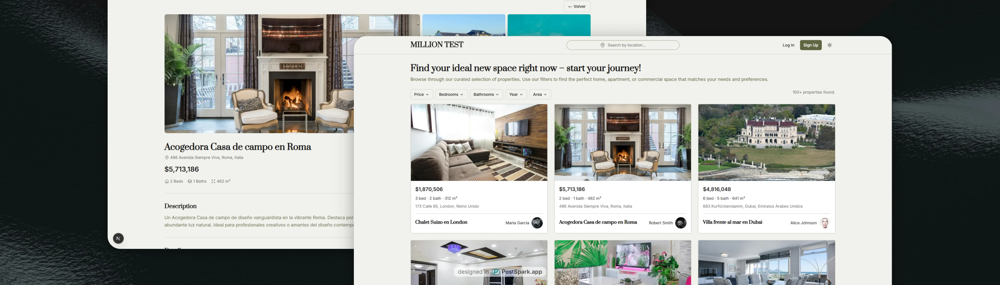

# Million Test - Full Stack Real Estate Application



## Descripción del Proyecto

Este repositorio contiene la solución completa de una aplicación full-stack para la gestión y visualización de propiedades inmobiliarias de lujo. El proyecto ha sido desarrollado como parte de una prueba técnica para demostrar capacidades avanzadas en arquitectura de software, desarrollo backend con .NET 8 y MongoDB, así como frontend moderno con Next.js 15 y React 19.

La aplicación implementa un sistema robusto de búsqueda y filtrado de propiedades, con una interfaz de usuario intuitiva y responsiva, respaldada por una API RESTful escalable y bien documentada.

---

## Objetivos Alcanzados

### Arquitectura y Diseño

El proyecto ha sido desarrollado siguiendo los principios de Clean Architecture en ambos extremos de la aplicación:

**Backend**: Implementación de arquitectura limpia con separación clara de responsabilidades en cuatro capas (API, Application, Domain, Infrastructure), utilizando patrones CQRS con MediatR, Repository Pattern y Dependency Injection. La estructura facilita el mantenimiento, testing y escalabilidad del sistema.

**Frontend**: Arquitectura basada en Feature-Sliced Design adaptada, organizando el código por características y capas de abstracción. Separación efectiva entre Server Components y Client Components de Next.js, maximizando el rendimiento mediante renderizado del lado del servidor cuando es apropiado.

### Funcionalidades Principales

La aplicación ofrece capacidades completas de gestión de propiedades inmobiliarias:

- **Sistema de Filtrado Avanzado**: Múltiples filtros simultáneos por precio, ubicación, características físicas (habitaciones, baños, área) y año de construcción. Los filtros se sincronizan con la URL para permitir compartir búsquedas específicas.

- **Búsqueda Geográfica**: Integración con OpenStreetMap/Nominatim para búsqueda de ubicaciones con autocompletado, permitiendo a los usuarios encontrar propiedades por ciudad o región de forma intuitiva.

- **Infinite Scroll**: Carga progresiva de resultados mediante Intersection Observer API, eliminando la necesidad de paginación tradicional y mejorando significativamente la experiencia de usuario.

- **Visualización de Detalles**: Vista completa de cada propiedad incluyendo galería de imágenes, información del propietario, características detalladas y historial de trazabilidad de ventas.

- **Responsive Design**: Interfaz totalmente adaptable a diferentes dispositivos y tamaños de pantalla, garantizando una experiencia consistente en desktop, tablet y móvil.

### Calidad y Rendimiento

**Testing**: Implementación de pruebas unitarias exhaustivas en ambos extremos. El backend cuenta con tests usando NUnit y Moq, mientras que el frontend utiliza Jest y React Testing Library. Se han cubierto componentes, hooks, servicios y handlers.

**Optimización**:

- Lazy loading de imágenes con next/image
- Debouncing en búsquedas para reducir peticiones innecesarias
- Memoización de componentes y cálculos costosos
- Queries optimizadas con índices en MongoDB
- Paginación eficiente en el backend

**Documentación**: Swagger/OpenAPI para la API REST, permitiendo exploración interactiva de endpoints. README detallados para ambos proyectos con guías de instalación, configuración y desarrollo.

---

## Estructura del Repositorio

```
million-test/
├── backend/                    # API REST en .NET 8
│   ├── MillionProperty.API/
│   ├── MillionProperty.Application/
│   ├── MillionProperty.Domain/
│   ├── MillionProperty.Infrastructure/
│   └── MillionProperty.Tests.Unit/
│
├── frontend/                   # Aplicación Next.js 15
│   ├── src/
│   │   ├── app/
│   │   ├── features/
│   │   ├── entities/
│   │   ├── shared/
│   │   └── services/
│   └── public/
│
├── docker-compose.yml          # Orquestación de servicios
└── README.md                   # Este archivo
```

---

## Stack Tecnológico

### Backend

- **.NET 8**: Framework principal para el desarrollo de la API
- **MongoDB**: Base de datos NoSQL para almacenamiento flexible
- **MediatR**: Implementación del patrón CQRS
- **AutoMapper**: Mapeo entre entidades y DTOs
- **FluentValidation**: Validación declarativa de modelos
- **NUnit**: Framework de pruebas unitarias
- **Swagger/OpenAPI**: Documentación interactiva de API

### Frontend

- **Next.js 15.5**: Framework React con App Router
- **React 19.1**: Biblioteca de interfaz de usuario
- **TypeScript 5**: Tipado estático para JavaScript
- **Tailwind CSS 4**: Framework de utilidades CSS
- **Jest**: Framework de pruebas
- **React Testing Library**: Testing de componentes

### Infraestructura

- **Docker & Docker Compose**: Contenedorización y orquestación
- **Nginx** (opcional): Proxy reverso para producción

---

## Inicio Rápido

### Prerrequisitos

- Docker y Docker Compose instalados
- Node.js 18+ (para desarrollo local del frontend)
- .NET SDK 8.0+ (para desarrollo local del backend)

### Ejecución con Docker Compose

```bash
# Clonar el repositorio
git clone <repository-url>
cd million-test

# Iniciar todos los servicios
docker-compose up -d

# Verificar que los contenedores estén corriendo
docker-compose ps
```

Una vez iniciados los servicios, la aplicación estará disponible en:

- **Frontend**: http://localhost:3000
- **Backend API**: http://localhost:8080/api
- **Swagger Documentation**: http://localhost:8080/swagger

### Detener los Servicios

```bash
docker-compose down
```

---

## Documentación Detallada

Para información específica sobre cada componente del proyecto, consulte la documentación correspondiente:

### Backend API

La documentación completa del backend incluye:

- Arquitectura detallada y patrones implementados
- Guía de instalación y configuración
- Descripción exhaustiva de endpoints con ejemplos
- Modelos de datos y validaciones
- Instrucciones para ejecutar pruebas unitarias
- Proceso de seeding de datos de prueba

**[Ver documentación completa del Backend →](./backend/README.md)**

### Frontend Application

La documentación del frontend cubre:

- Arquitectura Feature-Sliced Design
- Guía de instalación y scripts disponibles
- Características principales implementadas
- Patrones de diseño y mejores prácticas
- Estructura de carpetas y organización del código
- Estrategia de testing y convenciones de desarrollo

**[Ver documentación completa del Frontend →](./frontend/README.md)**

## Licencia

Este proyecto ha sido desarrollado como parte de una prueba técnica y es propiedad de Million Luxury.
